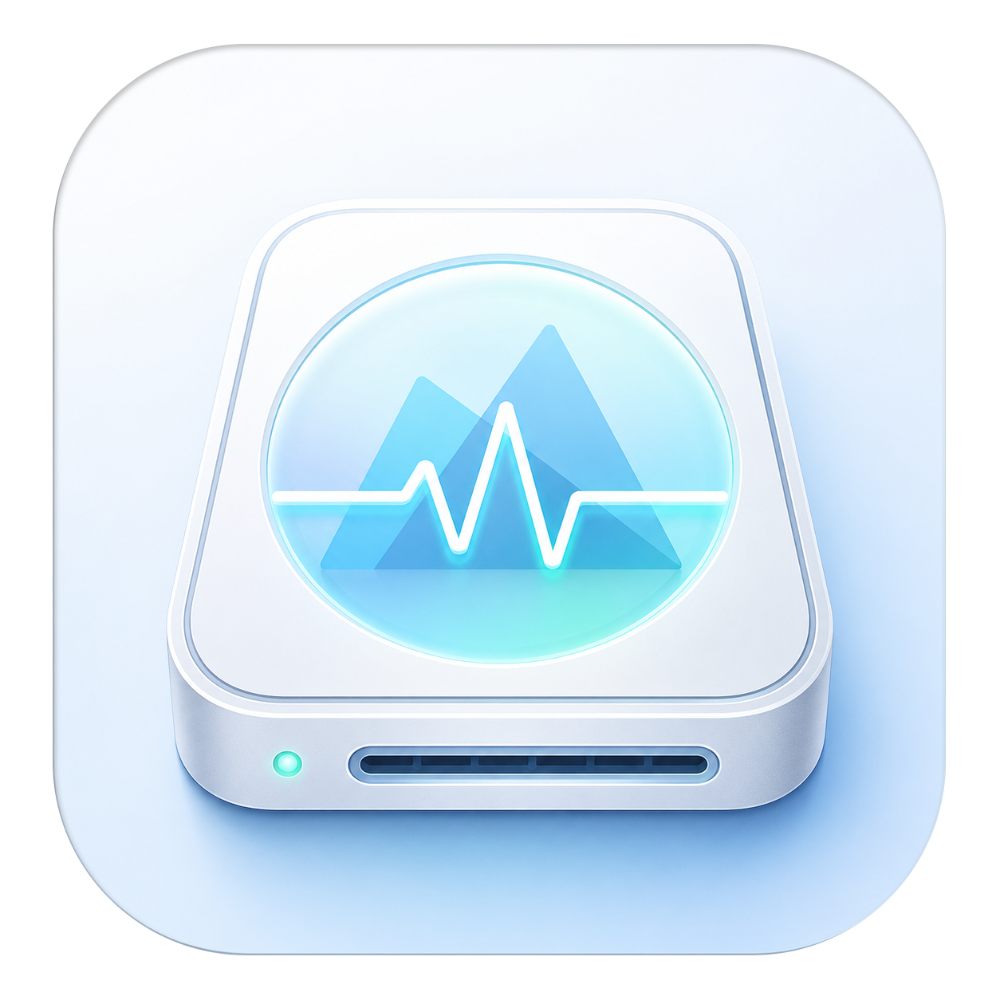

<p align="center">
  
</p>

<h1 align="center">MDriveHealth</h1>

<p align="center">
  Kiểm tra sức khoẻ ổ đĩa & hệ thống cho macOS — miễn phí, mã nguồn mở, cho cộng đồng Maclife 🇻🇳<br>
  <em>Drive & system health monitor for macOS — free and open source.</em>
</p>

---

## Tính năng / Features

| 🇻🇳 | 🇬🇧 |
|---|---|
| Đọc **SMART** ổ NVMe (kể cả SSD Apple / Apple Silicon) và SATA, không cần quyền root, không cần kext | Reads **SMART** from NVMe (including Apple SSDs on Apple Silicon) and SATA drives — no root, no kext |
| **Chấm điểm sức khoẻ**: điểm 0–100, xếp hạng Tốt→Hỏng, danh sách chỉ báo với mức độ nghiêm trọng | **Health scoring**: 0–100 score, Good→Failed rating, severity-ranked indicator list |
| **SSD lifetime**, nhiệt độ, sector lỗi/pending, tổng dữ liệu đã ghi, giờ hoạt động… | **SSD lifetime**, temperature, reallocated/pending sectors, total bytes written, power-on hours… |
| Bảng **thuộc tính SMART đầy đủ** với tên/cách decode theo từng model ổ (database 589 dòng ổ từ smartmontools) | Full **SMART attribute table** with per-model names/decoding (589-entry database from smartmontools) |
| **Lịch sử & biểu đồ** (SQLite + Swift Charts): nhiệt độ, điểm, wear theo thời gian | **History & charts** (SQLite + Swift Charts): temperature, score, wear over time |
| **Theo dõi nền + cảnh báo**: icon menu bar, thông báo khi sức khoẻ giảm / có sector lỗi mới / quá nhiệt | **Background monitoring + alerts**: menu bar icon, notifications on degradation / new defects / over-temp |
| **Self-test** ngắn & mở rộng cho ổ SATA (kèm lịch sử kết quả, tự theo dõi tiến độ); quét kernel log tìm lỗi I/O | Short & extended **self-tests** for SATA drives (with result history & auto progress); kernel-log I/O error scan |
| **Đo tốc độ** đọc/ghi (tuần tự + Random 4K, bypass cache) kèm lịch sử & so sánh | **Speed benchmark** (sequential + Random 4K, cache-bypassing) with history & comparison |
| **Dung lượng volume** trên từng ổ; ước tính **GB ghi/ngày** và dự phóng ngày cạn tuổi thọ SSD | Per-drive **volume usage**; **writes/day** estimate and SSD lifetime exhaustion projection |
| **Xuất báo cáo text** (copy/lưu file) để đăng lên group khi cần trợ giúp | **Text report export** (copy/save) for sharing when asking for help |
| **System Health**: pin (chu kỳ, % sức khoẻ), ~40 cảm biến nhiệt Apple Silicon, RAM/swap/áp lực bộ nhớ | **System Health**: battery (cycles, health %), ~40 Apple Silicon thermal sensors, RAM/swap/memory pressure |
| Giao diện tiếng Việt + English | Vietnamese + English UI |

## Cài đặt / Install

Tải file `.dmg` mới nhất từ [Releases](https://github.com/maclife-cloud/MDriveHealth/releases), mở và kéo **MDriveHealth** vào **Applications**.

> App được ký Developer ID và notarize bởi Apple — mở bình thường không bị Gatekeeper chặn.

## Build từ mã nguồn / Build from source

```bash
brew install xcodegen
git clone https://github.com/maclife-cloud/MDriveHealth.git
cd MDriveHealth
xcodegen generate
xcodebuild -project MDriveHealth.xcodeproj -scheme MDriveHealth -configuration Release build
```

CLI (debug/verify): `cd Packages/MDriveHealthCore && swift run mdrivehealth-cli`

## Kiến trúc / Architecture

```
Packages/MDriveHealthCore   # engine: IOKit discovery, NVMe/ATA SMART, drivedb,
                            # scoring, history, system health — 24 unit tests
├── CSMART (C)              # NVMeSMARTLib (private) + ATASMARTLib (public) bridge
App/                        # SwiftUI app: dashboard, charts, menu bar, alerts
tools/convert_drivedb.py    # smartmontools drivedb.h → drivedb.json
scripts/release.sh          # archive → sign → notarize → DMG
```

- NVMe: plugin IOKit `NVMeSMARTLib` (interface được smartmontools dùng ổn định nhiều năm, hoạt động với SSD Apple Fabric trên Apple Silicon).
- SATA: API công khai `ATASMARTLib`.
- Điểm số được tính deterministic từ các chỉ báo trọng yếu (5, 10, 184, 187, 188, 196, 197, 198, 199, wear attributes, NVMe critical warning…).

## Giới hạn đã biết / Known limitations

- **Ổ USB**: macOS không có driver SAT nên *không app nào* đọc được SMART qua cầu USB mass-storage từ userspace — hạn chế của hệ điều hành. Ổ Thunderbolt/NVMe nội bộ hoạt động đầy đủ. / No SMART over USB mass-storage bridges on macOS (OS limitation).
- **NVMe self-test**: giao diện NVMe của macOS không hỗ trợ — áp dụng với mọi công cụ. / Not supported by macOS NVMe interface (applies to all tools).

## Giấy phép / License

[GPL-3.0-or-later](LICENSE). Attribute database chuyển đổi từ [smartmontools](https://www.smartmontools.org) `drivedb.h` (GPL-2.0-or-later) — cảm ơn dự án smartmontools! Icon và toàn bộ code còn lại © cộng đồng Maclife.
